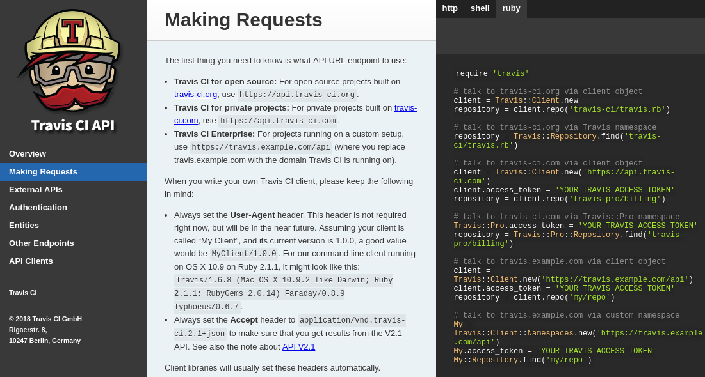
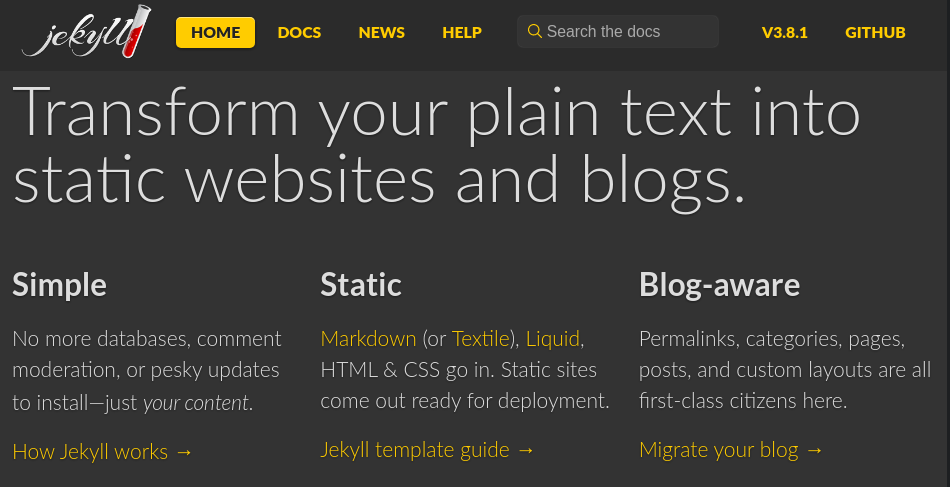
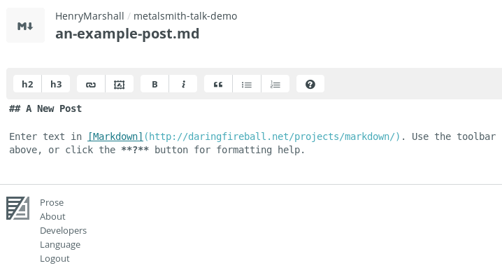

## Modern Static Sites
#### Building (Free) Interactive Websites

Henry Marshall
Penguicon 2018
henry@isagoddamn.ninja

====

## What is a Static Site?

Note:
- A normal website, with some trade offs

----

## The Same for Everyone

Note:
- No logins
- No editing (wiki)
- No shopping cart
- No intelligent suggestions
- No A/B testing

----

## Blazing Fast

Note:
- Decisions already made when user visits
- Compile time vs run time

----

## Highly Secure

Note:
- No database to corrupt or loot
- Limited to defacing

----

## Free (or Cheap)

Note:
- Github will host for free
- Optionally use your own domain
- Optionally host on S3

----

## Simple Markup

Note:
- rst or md
- coding optional

----

## Limited Interactivity\*

- Google Analytics
- Accepting Money
- Comments

Note:
- Embedding other non-static sites in your own
- JAMstack

====

## Examples

----

Note: Blog: Classic use case

----

Note: Magazine: Saw a 6-10x speed improvement over Wordpress!

----

Note: Business: Not a store. Learn more about the brand

----

Note: Documentation: User can choose language

----

[]](https://github.com/henrymarshall/metalsmith-talk)

====

## Static Site Generators

Notes:
- More than just Jekyll and Metalsmith
- Hugo (fast)
- GitBook (ebook & docs)
- Gatsby (react)
- Pelican (wordpress imports)

----

## Metalsmith

Note:
- Modular
  - Infinitely customizable
  - Documentation quality varies
  - Above features are achievable (Jekyll templates)
- Managed with Git
- Developer focused
- Conceptually similar to Gulp

----

Note:
- Community
- Support
- Templates for blogs
- Easiest to use with GH pages
- Normally managed with git

----

Note:
- CMS-like post management
- Only with Jekyll
- There are alternatives -- most paid; some worth it

====

## Free (or Cheap) Hosting

Note:
- Jekyll is easiest for Github Pages
- AWS S3: More Control; More Complexity
  - 302 redirects for certain config
  - Configurable caching/CDN

----

## Getting a Domain

Note:
- CMS often includes domain with monthly fees
- Namecheap - real cheap
- Hover - concierge service

====

## Accepting Donations with Stripe

Note:
- I work for Stripe.
- We're hiring!

----

## Add [Stripe Checkout](https://stripe.com/docs/quickstart) to [your Site](https://github.com/HenryMarshall/metalsmith-talk-demo/blob/master/src/layouts/partials/footer.hbs#L10)

----

## [Serverless](https://runkit.com/henrymarshall/metalsmith-talk-stripe-charge)

Note:
- Runkit (owned by Stripe)
- AWS Lambda
- Google Cloud Functions

----

## Complete your Charge

====

## JSON API

====

## [Comments with Disqus](https://github.com/HenryMarshall/metalsmith-talk-demo/blob/master/src/layouts/blog-post.hbs#L25)

====

## Questions

